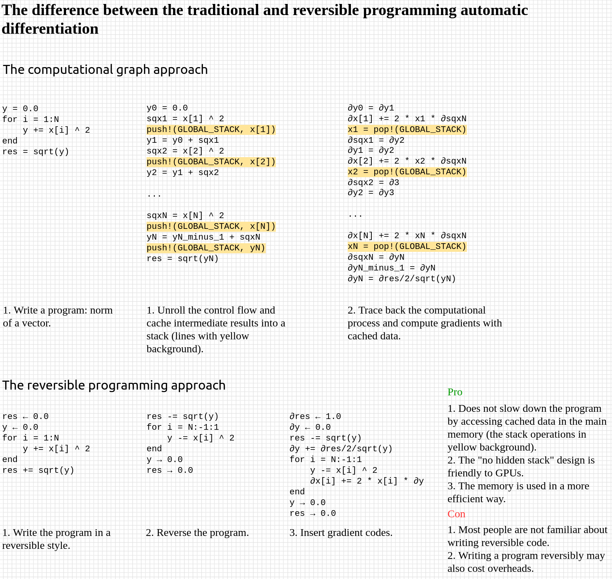

NiLang.jl (逆lang), is a reversible domain-specific language (DSL) that allow a program to go back to the past.

* Requires Julia version >= 1.3,
* If test breaks, try using the master branch of `NiLangCore`,
* Now a function dataview is specified by `x |> bijection`, e.g. the preivous `grad(x)` now should be written as `x |> grad` in the reversible context.
* Our paper uses version v0.6, which might be different from the master branch.


NiLang features:

* any program written in NiLang is differentiable,
* a reversible language with abstraction and arrays,
* complex values

[](https://GiggleLiu.github.io/NiLang.jl/stable)
[](https://GiggleLiu.github.io/NiLang.jl/dev)
[](https://travis-ci.com/GiggleLiu/NiLang.jl)
[](https://codecov.io/gh/GiggleLiu/NiLang.jl)

> The strangeness of reversible computing is mainly due to
> our lack of experience with it.—Henry Baker, 1992

## To Start
```
pkg> add NiLang
```

## An example: Compute the norm of a vector
```julia
julia> using NiLang

julia> function f(res, y, x)
           for i=1:length(x)
               y += x[i] ^ 2
           end
           res += sqrt(y)
       end
f (generic function with 1 method)

julia> @i function f(res, y, x)
           for i=1:length(x)
               y += x[i] ^ 2
           end
           res += sqrt(y)
       end

julia> res_out, y_out, x_out = f(0.0, 0.0, [1, 2, 3.0])
(3.7416573867739413, 14.0, [1.0, 2.0, 3.0])

julia> (~f)(res_out, y_out, x_out)  # automatically generated inverse program.
(0.0, 0.0, [1.0, 2.0, 3.0])
        
julia> ∂res, ∂y, ∂x = NiLang.AD.gradient(Val(1), f, (0.0, 0.0, [1, 2, 3.0]))  # automatic differentiation, `Val(1)` means the first argument of `f` is the loss.
(1.0, 0.1336306209562122, [0.2672612419124244, 0.5345224838248488, 0.8017837257372732])
```

The performance of reversible programming automatic differentiation is much better than most traditional frameworks. Here is why, and how it works,



## Check our [paper](https://arxiv.org/abs/2003.04617)

```bibtex
@misc{Liu2020,
    title={Differentiate Everything with a Reversible Programming Language},
    author={Jin-Guo Liu and Taine Zhao},
    year={2020},
    eprint={2003.04617},
    archivePrefix={arXiv},
    primaryClass={cs.PL}
}
```
