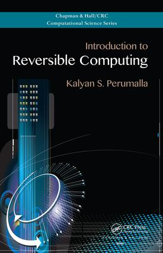

# What is Reversible Computing and why do we need it

# what is reversible computing
Reversible computing is a computing paradigm that can deterministically undo all the previous changes, which requires user not erasing any information during computations. It boomed during 1970-2005, however, but runs into a winter after that. The following book covers most of reversible computing that you want to know, especially the software part.

## Why reversible computing is the future: a physicist's perspective

Reversible computing can do anything traditional computing can do. It can be simulated on a irreversible device, but sometimes need either more space or time or both. So, why are people still interested in reversible computing?

### From the energy perspective

Energy is one of the most important bottleneck of computation. Energy efficiency of computing devices affect the value of [bitcoins](https://www.investopedia.com/news/do-bitcoin-mining-energy-costs-influence-its-price/), user experiences of your cell phone, artificial intelligence (AI) industry.

Reversible computing devices are more energy efficiency, citing the famous [Landauer's principle](https://en.wikipedia.org/wiki/Landauer%27s_principle)

> Landauer's principle is a physical principle pertaining to the lower theoretical limit of energy consumption of computation. It holds that "any logically irreversible manipulation of information, such as the erasure of a bit or the merging of two computation paths, must be accompanied by a corresponding entropy increase in non-information-bearing degrees of freedom of the information-processing apparatus or its environment".Another way of phrasing Landauer's principle is that if an observer loses information about a physical system, the observer loses the ability to extract work from that system.

In the future, the building block of information technology is probably based on microscopic dynamics (e.g. cold atoms, DNA, quantum dot). Irreversibility is rare in these systems. Irreversible dynamics is available only in macroscopic world, where you assume the existence an infinite sized "bath". For example, Like "measure" operation in quantum computing (a kind of reversible computing) is irreversible, as well as one of the slowest operation on quantum devices, one have to wait for the read out signal.

However, investors lost interest to reversible computing at around 2005 according to [this paper](https://arxiv.org/abs/1803.02789) because energy efficiency of traditional CMOS is still approximately 2 orders above the Landauer's limit, there should still be a lot room to improve, while many reversible computing devices are not "technical smooth". 

Undoubtedly, traditional CMOS comes into the bottleneck of energy efficiency recent years. The reversible computing scheme adiabatic CMOS is technical smooth and shows orders more energy efficient than traditional CMOS, and it is [already useful in spacecrafts](https://www.osti.gov/servlets/purl/1377599). The detailed analysis of the energy-speed trade off in adiabatic CMOS can be found [here](https://www3.nd.edu/~lent/pdf/nd/AdiabaticCMOS_HanninenSniderLent2014.pdf).

## From the artificial intelligence perspective

In reversible programming, [differentiable programming is directly achievable](https://arxiv.org/abs/2003.04617). Notice most differentiable programming are built up of basic instructions like "+", "*", "/", "-". We can use these basic instructions to write Bessel functions, singular value decompositions et. al. Reversible programming allows you to define adjoint rules on instructions only, rather than defining a lot primitives. **This timing is perfect because at this timing, AI is very popular with a lot amazing applications. It requires reversibility for AD, and it is also power consuming.** In the past, most source to source AD frameworks are based checkpointing. Checkpointing is a naive version of reversible programming that caches everything into a global stack. Reversible programming provides us more flexibility.

## Embrace Reversible Computing: Software goes first

1. Reversible hardwares relies on reversible software and compiling techniques.
The inverse is not true. Reversible hardware is an energy efficient host for reversible programs.

2. Reversible programming is already useful in machine learning, it is technical smooth to embrace reversible computing from the software side.

## FAQ

**Q: does this compose with cudanative kernels? So we don't have to write custom adjoints?**

A: It is composible with KernelAbstraction, we have an example [here](https://giggleliu.github.io/NiLang.jl/dev/examples/besselj/#CUDA-programming-1 )
For CUDAnative, the problem is the power operations ^ on GPU is not compatible with that on CPU. It can be solved, but needs some patch.

Still, I want to emphasis writing differentiable parallel kernels have the problem of share read in forward will become shared write when back propagating gradients, which produces wrong gradients. It is a known hard problem in combining CUDA programming and differential programming.
